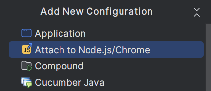

# Kotlin VS Code Extension

This is an example of a VS Code extension developed entirely in Kotlin.

## Prerequisites

- A local VS Code installation. Download it [here][1] (>=1.86.0)
- The VS Code installation directory in the system's `PATH` environment variable.  
  For example: `C:\Users\{user-name}\AppData\Local\Programs\Microsoft VS Code\bin`

### Important notes

VS Code is currently based on Electron 27, which supports only CommonJS modules.

Future versions of VS Code will move to Electron 28+, which will most likely
provide support for ES modules.

## Starting the extension

To use the extension in a VS Code development sandbox, invoke:

```
./gradlew :vscode-extension:debugExtension`
```

It will build the appropriate JS distribution and fire up a VS Code instance.

## Debugging the extension

Once the extension has been started using `debugExtension`, you can
use IntelliJ IDEA's **Attach to Node.js/Chrome** Run Configuration.



Once the remote debug session is started, you can place breakpoints.

## Testing the extension

To understand how VS Code testing works, see the [Testing Extensions][2] 
chapter of the official documentation.

Under **Advanced setup: Your own runner** you can see that the entry point
for the test runner must be provided via `--extensionTestsPath`.

```
code --extensionDevelopmentPath=<EXTENSION-ROOT-PATH> --extensionTestsPath=<TEST-RUNNER-SCRIPT-PATH>
```

The [test runner script][3] must export a top level `run(): Promise<void>` function,
so that the VS Code sandbox can be notified of a success or a failure.

```js
...
return new Promise((resolve, reject) => {
  try {
    // Run the mocha test
    mocha.run(failures => {
      if (failures > 0) {
        reject(new Error(`${failures} tests failed.`));
      } else {
        resolve();
      }
    });
  } catch (err) {
    reject(err);
  }
});
```

[1]: https://code.visualstudio.com/download

[2]: https://code.visualstudio.com/api/working-with-extensions/testing-extension#advanced-setup-your-own-runner

[3]: https://code.visualstudio.com/api/working-with-extensions/testing-extension#the-test-runner-script
